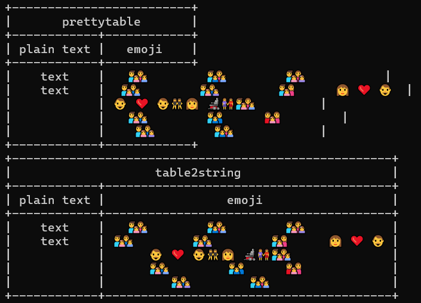
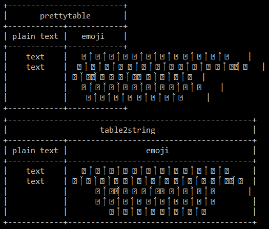
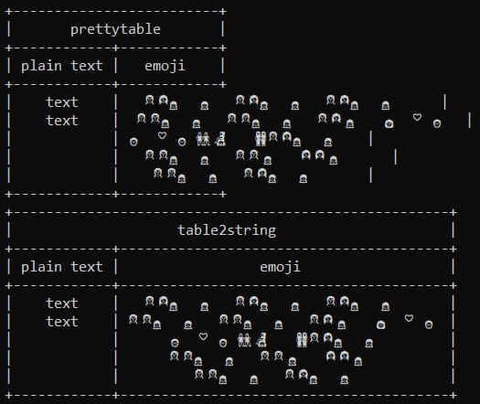
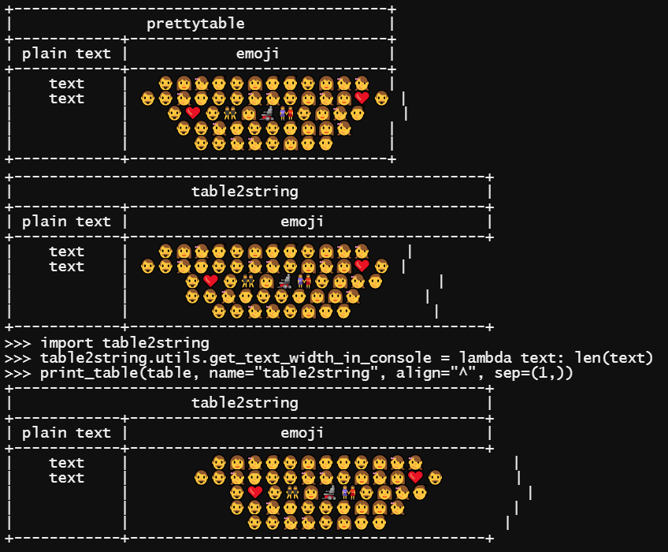

# table2string

[](https://github.com/EgorKhabarov/table2string/actions/workflows/tests.yml)
[](https://github.com/EgorKhabarov/table2string/actions/workflows/publish.yml)

[](https://pypi.python.org/pypi/table2string)
[](https://pypi.python.org/pypi/table2string)
[](https://pypi.python.org/pypi/table2string)
[](https://pypi.org/project/table2string/)

[](https://github.com/psf/black)
[](https://github.com/python/mypy)
[](https://github.com/astral-sh/ruff)


## Convert table to string

While there are several libraries available for converting tables to strings in Python, none seemed to meet my specific requirements. 

- **Line Break Support**: Easily include line breaks within cells for enhanced readability.
- **Subtable Support**: Easily include a table within a table for a more flexible presentation.
- **Alignment**: Easily align text in a cell in any direction.
- **Emoji Integration**: Effortlessly incorporate emoji characters into your tables to add visual appeal and context.

---

# Install

## PyPI

```shell
pip install -U table2string
```

## GitHub

```shell
pip install -U git+https://github.com/EgorKhabarov/table2string.git@master
```

---

# Usage example

```pycon
>>> from table2string import Table, Themes, HorizontalAlignment, VerticalAlignment
>>> Table([("1", "2", "3"), ("qwe", "rty\nuio", "")], name="Table Name", column_names=("c1", "c2", "c3")).print()
+----------------+
|   Table Name   |
+-----+-----+----+
| c1  | c2  | c3 |
+-----+-----+----+
|   1 |   2 |  3 |
+-----+-----+----+
| qwe | rty |    |
|     | uio |    |
+-----+-----+----+
>>> from io import StringIO
>>> Table.from_csv(StringIO('c1,c2,c3\n1,2,3\nqwe,"rty\nuio",'), name="Table Name").print()
+----------------+
|   Table Name   |
+-----+-----+----+
| c1  | c2  | c3 |
+-----+-----+----+
|   1 |   2 |  3 |
+-----+-----+----+
| qwe | rty |    |
|     | uio |    |
+-----+-----+----+
>>> import sqlite3
>>> cursor = sqlite3.connect(":memory:").cursor().execute(
...     "CREATE TABLE data (c1 TEXT, c2 TEXT, c3 TEXT);"
... ).executemany(
...     "INSERT INTO data (c1, c2, c3) VALUES (?, ?, ?);",
...     [("1", "2", "3"), ("qwe", "rty\nuio", "")],
... ).execute(
...     "SELECT c1, c2, c3 FROM data;"
... )
>>> Table.from_db_cursor(
...     cursor,
...     name="Table Name",
...     column_names=True,
... ).print()
+----------------+
|   Table Name   |
+-----+-----+----+
| c1  | c2  | c3 |
+-----+-----+----+
|   1 |   2 |  3 |
+-----+-----+----+
| qwe | rty |    |
|     | uio |    |
+-----+-----+----+
>>> Table(
...     [("c1", Table([("1", "2"), ("3", "4")], name="SubTable"))],
...     name="Table Name",
... ).print(v_align=("-",), max_width=(2, 8))
+---------------+
|  Table Name   |
+----+----------+
|    | SubTable |
|    +-----+----+
| c1 |   1 |  2 |
|    +-----+----+
|    |   3 |  4 |
+----+-----+----+

```

## Arguments

| Argument                 | Type                                                                                              | Example                         | Description                                                                                                                                                 |
|:-------------------------|:--------------------------------------------------------------------------------------------------|:--------------------------------|:------------------------------------------------------------------------------------------------------------------------------------------------------------|
| `table`                  | `Sequence[Sequence[Any]]`                                                                         | `[("1", "2"), ("3", "4")]`      | A two-dimensional matrix                                                                                                                                    |
| `h_align`                | <code>tuple[HorizontalAlignment &#x7c; str, ...]</code> &#x7c; `HorizontalAlignment` &#x7c; `str` | `HorizontalAlignment.CENTER`    | Allows you to align text in a cell horizontally                                                                                                             |
| `v_align`                | <code>tuple[VerticalAlignment &#x7c; str, ...]</code> &#x7c; `VerticalAlignment` &#x7c; `str`     | `VerticalAlignment.MIDDLE`      | Allows you to align text in a cell vertically                                                                                                               |
| `name`                   | `str` &#x7c; `None`                                                                               | `"Table Name"`                  | Table name                                                                                                                                                  |
| `name_h_align`           | `HorizontalAlignment` &#x7c; `str`                                                                | `HorizontalAlignment.CENTER`    | Allows you to align table name horizontally                                                                                                                 |
| `name_v_align`           | `VerticalAlignment` &#x7c; `str`                                                                  | `VerticalAlignment.MIDDLE`      | Allows you to align table name vertically                                                                                                                   |
| `column_names`           | `Sequence[str]` &#x7c; `None`                                                                     | `("c1", "c2", ...column_count)` | Sets the names for the table columns                                                                                                                        |
| `column_names_h_align`   | <code>tuple[HorizontalAlignment &#x7c; str, ...]</code> &#x7c; `HorizontalAlignment` &#x7c; `str` | `HorizontalAlignment.CENTER`    | Allows you to align column names horizontally                                                                                                               |
| `column_names_v_align`   | <code>tuple[VerticalAlignment &#x7c; str, ...]</code> &#x7c; `VerticalAlignment` &#x7c; `str`     | `VerticalAlignment.MIDDLE`      | Allows you to align column names vertically                                                                                                                 |
| `max_width`              | `int` &#x7c; `Tuple[int, ...]` &#x7c; `None`                                                      | `120`                           | Allows you to set the width of the entire table or individually for each column                                                                             |
| `max_height`             | `int` &#x7c; `None`                                                                               | `10`                            | Specifies the maximum height for rows                                                                                                                       |
| `maximize_height`        | `bool`                                                                                            | `True`                          | Force height to be taken from max_height                                                                                                                    |
| `line_break_symbol`      | `str`                                                                                             | `"\\"`                          | Line break symbol                                                                                                                                           |
| `cell_break_symbol`      | `str`                                                                                             | `"…"`                           | Symbol indicating the end of text when there is not enough height                                                                                           |
| `sep`                    | `bool` &#x7c; `range` &#x7c; `tuple`                                                              | `(1, 3, 6)`                     | Handles the separators between table rows and can be either a boolean type or possess a `__contains__` method                                               |
| `end`                    | `str` &#x7c; `None`                                                                               | `"\n"`                          | Behaves the same as `print(end=)`                                                                                                                           |
| `file`                   | `TextIOWrapper` &#x7c; `None`                                                                     | `sys.stdout` or `io.StringIO()` | Behaves the same as `print(file=)`                                                                                                                          |
| `theme`                  | `Theme`                                                                                           | `Themes.rounded_thick`          | Allows you to set a specific theme for the table. For example, the border style                                                                             |
| `ignore_width_errors`    | `bool`                                                                                            | `False`                         | Fixes errors in max_width if they exist                                                                                                                     |
| `proportion_coefficient` | `float`                                                                                           | `0.5`                           | Affects the width distribution of the columns. A value of `0.0` corresponds to proportional distribution, `1.0` averages the values, and `2.0` inverts them |


## Text alignment

| Align                                     | Example           | Description                                                                                                                    |
|:------------------------------------------|:------------------|:-------------------------------------------------------------------------------------------------------------------------------|
| `"<align>"` or `("<align>",)`             | `"^"` or `("^",)` | Setting `align` (`"^"`) for all columns                                                                                        |
| `("<align_1>", "<align_2>")`              | `("^", "<")`      | Setting `align_1` (`"^"`) for the first column and `align_2` (`"<"`) for all other columns                                     |
| `("<align_1>", "<align_2>", "<align_3>")` | `("^", "<", ">")` | Setting `align_1` (`"^"`) for the first column and `align_2` (`"<"`) for the second and `align_3` (`">"`) for the third column |

You can also use the corresponding `HorizontalAlignment` or `VerticalAlignment` type

For `name_h_align` and `name_v_align` only the `str` type or the corresponding `HorizontalAlignment` or `VerticalAlignment` type is valid

### HorizontalAlignment

| Align                                      | Description                                                                                                                                          |
|:-------------------------------------------|:-----------------------------------------------------------------------------------------------------------------------------------------------------|
| `AUTO` or `AUTO_AUTO` or `*` or `**`       | Alignment depends on the type. If this is a number and there are no line breaks in this cell, then align to the right; otherwise, align to the left. |
| `LEFT` or `LEFT_LEFT` or `<` or `<<`       | All lines are left aligned                                                                                                                           |
| `CENTER` or `CENTER_CENTER` or `^` or `^^` | All lines are center aligned                                                                                                                         |
| `RIGHT` or `RIGHT_RIGHT` or `>` or `>>`    | All lines are right aligned                                                                                                                          |
| `LEFT_CENTER` or `<^`                      | The first line is left aligned and the remaining lines are centered                                                                                  |
| `LEFT_RIGHT` or `<>`                       | The first line is left aligned and the remaining lines are right aligned                                                                             |
| `CENTER_LEFT` or `^<`                      | The first line is aligned to the center, and the remaining lines are aligned to the left of the first line.                                          |
| `CENTER_RIGHT` or `^>`                     | The first line is aligned to the center, and the remaining lines are aligned to the right of the first line.                                         |
| `RIGHT_LEFT` or `><`                       | The first line is right aligned and the remaining lines are left aligned                                                                             |
| `RIGHT_CENTER` or `>^`                     | The first line is right aligned and the remaining lines are centered                                                                                 |

### VerticalAlignment

| Align           | Description             |
|:----------------|:------------------------|
| `TOP` or `^`    | Text are top aligned    |
| `MIDDLE` or `-` | Text are centered       |
| `BOTTOM` or `_` | Text are bottom aligned |


<details>
<summary>Example</summary>

```pycon
>>> from functools import partial
>>> sub_table_auto_func = partial(Table, [("123", "text",)], max_height=4, maximize_height=True)
>>> sub_table_func = partial(Table, [("first line\ntext",)], max_height=4, maximize_height=True)
>>> Table(
...     [
...         *(
...             [v_align, sub_table_auto_func(h_align="*", v_align=v_align)] + [
...                 sub_table_func(h_align=h_align, v_align=v_align)
...                 for h_align in ("<", ">", "^", "^<", "^>")
...             ]
...             for v_align in ("^", "-", "_")
...         )
...     ],
...     column_names=(" ", "*", "<", ">", "^", "^<", "^>"),
... ).print(max_width=(1, len("first line")+4), v_align=("-",))
+---+----------------+----------------+----------------+----------------+----------------+----------------+
|   |       *        |       <        |       >        |       ^        |       ^<       |       ^>       |
+---+-------+--------+----------------+----------------+----------------+----------------+----------------+
|   |   123 | text   | first line     |     first line |   first line   |   first line   |   first line   |
| ^ |       |        | text           |           text |      text      |   text         |         text   |
|   |       |        |                |                |                |                |                |
|   |       |        |                |                |                |                |                |
+---+-------+--------+----------------+----------------+----------------+----------------+----------------+
|   |       |        |                |                |                |                |                |
| - |   123 | text   | first line     |     first line |   first line   |   first line   |   first line   |
|   |       |        | text           |           text |      text      |   text         |         text   |
|   |       |        |                |                |                |                |                |
+---+-------+--------+----------------+----------------+----------------+----------------+----------------+
|   |       |        |                |                |                |                |                |
| _ |       |        |                |                |                |                |                |
|   |       |        | first line     |     first line |   first line   |   first line   |   first line   |
|   |   123 | text   | text           |           text |      text      |   text         |         text   |
+---+-------+--------+----------------+----------------+----------------+----------------+----------------+

```
</details>

## Custom width and height settings

| Width                               | Example        | Description                                                                                                                 |
|-------------------------------------|----------------|-----------------------------------------------------------------------------------------------------------------------------|
| `<width>`                           | `10`           | Setting `width` (`10`) for the whole table                                                                                  |
| `(<width>,)`                        | `(10,)`        | Setting `width_1` (`10`) for all column                                                                                     |
| `(<width_1>, <width_2>)`            | `(10, 20)`     | Setting `width_1` (`10`) for the first column and `width_2` (`20`) for all other columns                                    |
| `(<width_1>, <width_2>, <width_3>)` | `(10, 20, 30)` | Setting `width_1` (`10`) for the first column and `width_2` (`20`) for the second and `width_3` (`30`) for the third column |

<details>
<summary>Example</summary>

```pycon
>>> # Width of the entire table with borders
>>> Table([(1, 12345, "example")]).print(max_width=30)
+-----+----------+-----------+
|   1 |    12345 | example   |
+-----+----------+-----------+
>>> # Width of each column individually
>>> Table([(1, 12345, "example")]).print(max_width=(10,))
+------------+------------+------------+
|          1 |      12345 | example    |
+------------+------------+------------+
>>> Table([(1, 12345, "example")]).print(max_width=(1, 8, 6))
+---+----------+--------+
| 1 |    12345 | exampl\|
|   |          | e      |
+---+----------+--------+
>>> Table([(1, 12345, "example")]).print(max_width=(1, 5, 7))
+---+-------+---------+
| 1 | 12345 | example |
+---+-------+---------+
>>> Table([("123456\n\n789000", "example")]).print(max_width=(3, 4), max_height=4)
+-----+------+
| 123\| exam\|
| 456 | ple  |
|     |      |
| 789…|      |
+-----+------+
>>> Table([("123456789",)]).print(max_width=(1,), max_height=1)
+---+
| 1…|
+---+
>>> Table([("123\n456\n789",)]).print(
...     max_width=(3,),
...     max_height=4,
...     maximize_height=True,
... )
+-----+
| 123 |
| 456 |
| 789 |
|     |
+-----+
>>> Table([("123456789",)]).print(
...     max_width=(3,),
...     max_height=4,
...     maximize_height=True,
... )
+-----+
| 123\|
| 456\|
| 789 |
|     |
+-----+

```
</details>

## Separator settings

| Separator              | Description                                |
|------------------------|--------------------------------------------|
| `sep=True`             | All horizontal dividers included           |
| `sep=False`            | All horizontal dividers are disabled       |
| `sep=(1,)`             | Only first delimiter                       |
| `sep=(1, 3, 5)`        | Only first third and fifth separator       |
| `sep=range(1, 100, 5)` | Delimiter every five lines first 100 lines |

<details>
<summary>Example</summary>

```pycon
>>> table_1 = Table([("qwe", "rty\nuio"), ("123456\n\n789000", "example")])
>>> kwargs = {
...     "max_width": (3, 4),
...     "max_height": 4,
... }
>>> table_1.print(**kwargs, sep=True)
+-----+------+
| qwe | rty  |
|     | uio  |
+-----+------+
| 123\| exam\|
| 456 | ple  |
|     |      |
| 789…|      |
+-----+------+
>>> table_1.print(**kwargs, sep=False)
+-----+------+
| qwe | rty  |
|     | uio  |
| 123\| exam\|
| 456 | ple  |
|     |      |
| 789…|      |
+-----+------+
>>> table_2 = Table([("1", "2"), ("3", "4")], name="Name")
>>> table_2.print(sep=True)
+-------+
| Name  |
+---+---+
| 1 | 2 |
+---+---+
| 3 | 4 |
+---+---+
>>> table_2.print(sep=False)
+-------+
| Name  |
+---+---+
| 1 | 2 |
| 3 | 4 |
+---+---+
>>> table_3 = Table([("1", "2"), ("3", "4"), ("5", "6"), ("7", "8")])
>>> table_3.print(sep=(1,))
+---+---+
| 1 | 2 |
+---+---+
| 3 | 4 |
| 5 | 6 |
| 7 | 8 |
+---+---+
>>> table_3.print(sep=(2,))
+---+---+
| 1 | 2 |
| 3 | 4 |
+---+---+
| 5 | 6 |
| 7 | 8 |
+---+---+
>>> table_3.print(sep=(1, 3))
+---+---+
| 1 | 2 |
+---+---+
| 3 | 4 |
| 5 | 6 |
+---+---+
| 7 | 8 |
+---+---+
>>> table_4 = Table([("1", "2"), ("3", "4"), ("5", "6"), ("7", "8")], name="Name")
>>> table_4.print(sep=(1,))
+-------+
| Name  |
+---+---+
| 1 | 2 |
+---+---+
| 3 | 4 |
| 5 | 6 |
| 7 | 8 |
+---+---+
>>> table_4.print(sep=(2,))
+-------+
| Name  |
+---+---+
| 1 | 2 |
| 3 | 4 |
+---+---+
| 5 | 6 |
| 7 | 8 |
+---+---+
>>> table_4.print(sep=(1, 3))
+-------+
| Name  |
+---+---+
| 1 | 2 |
+---+---+
| 3 | 4 |
| 5 | 6 |
+---+---+
| 7 | 8 |
+---+---+

```
</details>

## Themes

### Borders

<details>
<summary>Border types</summary>

```pycon
>>> from table2string import Themes, HorizontalAlignment
>>> table = []
>>> example_table = Table([(" ", " "), (" ", " "), (" ", " ")])
>>> theme_names = (
...     ("ascii_thin", "ascii_thin_double"),
...     ("ascii_double", "ascii_double_thin"),
...     ("thin", "thin_thick"),
...     ("thin_double", "rounded_double"),
...     ("rounded", "rounded_thick"),
...     ("thick", "thick_thin"),
...     ("double", "double_thin"),
...     ("booktabs", "ascii_booktabs"),
...     ("markdown", "None"),
... )
>>> for names in theme_names:
...     table.append([])
...     for name in names:
...         string_table = example_table.stringify(
...             theme=getattr(Themes, name, Themes.ascii_thin)
...         )
...         table[-1].append(f"{name}\n{string_table}")
>>> Table(table).print(theme=Themes.thin, h_align=HorizontalAlignment.CENTER)
┌──────────────┬───────────────────┐
│  ascii_thin  │ ascii_thin_double │
│  +---+---+   │     +---+---+     │
│  |   |   |   │     |   |   |     │
│  +---+---+   │     +===+===+     │
│  |   |   |   │     |   |   |     │
│  +---+---+   │     +---+---+     │
│  |   |   |   │     |   |   |     │
│  +---+---+   │     +---+---+     │
├──────────────┼───────────────────┤
│ ascii_double │ ascii_double_thin │
│  +===+===+   │     +===+===+     │
│  ‖   ‖   ‖   │     ‖   ‖   ‖     │
│  +===+===+   │     +---+---+     │
│  ‖   ‖   ‖   │     ‖   ‖   ‖     │
│  +===+===+   │     +===+===+     │
│  ‖   ‖   ‖   │     ‖   ‖   ‖     │
│  +===+===+   │     +===+===+     │
├──────────────┼───────────────────┤
│     thin     │    thin_thick     │
│  ┌───┬───┐   │     ┌───┬───┐     │
│  │   │   │   │     │   │   │     │
│  ├───┼───┤   │     ┝━━━┿━━━┥     │
│  │   │   │   │     │   │   │     │
│  ├───┼───┤   │     ├───┼───┤     │
│  │   │   │   │     │   │   │     │
│  └───┴───┘   │     └───┴───┘     │
├──────────────┼───────────────────┤
│ thin_double  │  rounded_double   │
│  ┌───┬───┐   │     ╭───┬───╮     │
│  │   │   │   │     │   │   │     │
│  ╞═══╪═══╡   │     ╞═══╪═══╡     │
│  │   │   │   │     │   │   │     │
│  ├───┼───┤   │     ├───┼───┤     │
│  │   │   │   │     │   │   │     │
│  └───┴───┘   │     ╰───┴───╯     │
├──────────────┼───────────────────┤
│   rounded    │   rounded_thick   │
│  ╭───┬───╮   │     ╭───┬───╮     │
│  │   │   │   │     │   │   │     │
│  ├───┼───┤   │     ┝━━━┿━━━┥     │
│  │   │   │   │     │   │   │     │
│  ├───┼───┤   │     ├───┼───┤     │
│  │   │   │   │     │   │   │     │
│  ╰───┴───╯   │     ╰───┴───╯     │
├──────────────┼───────────────────┤
│    thick     │    thick_thin     │
│  ┏━━━┳━━━┓   │     ┏━━━┳━━━┓     │
│  ┃   ┃   ┃   │     ┃   ┃   ┃     │
│  ┣━━━╋━━━┫   │     ┠───╂───┨     │
│  ┃   ┃   ┃   │     ┃   ┃   ┃     │
│  ┣━━━╋━━━┫   │     ┣━━━╋━━━┫     │
│  ┃   ┃   ┃   │     ┃   ┃   ┃     │
│  ┗━━━┻━━━┛   │     ┗━━━┻━━━┛     │
├──────────────┼───────────────────┤
│    double    │    double_thin    │
│  ╔═══╦═══╗   │     ╔═══╦═══╗     │
│  ║   ║   ║   │     ║   ║   ║     │
│  ╠═══╬═══╣   │     ╟───╫───╢     │
│  ║   ║   ║   │     ║   ║   ║     │
│  ╠═══╬═══╣   │     ╠═══╬═══╣     │
│  ║   ║   ║   │     ║   ║   ║     │
│  ╚═══╩═══╝   │     ╚═══╩═══╝     │
├──────────────┼───────────────────┤
│   booktabs   │  ascii_booktabs   │
│   ───────    │      -------      │
│              │                   │
│   ━━━━━━━    │      =======      │
│              │                   │
│   ───────    │      -------      │
│              │                   │
│   ───────    │      -------      │
├──────────────┼───────────────────┤
│   markdown   │       None        │
│  |   |   |   │     +---+---+     │
│  |---|---|   │     |   |   |     │
│  |   |   |   │     +---+---+     │
│  |   |   |   │     |   |   |     │
│              │     +---+---+     │
│              │     |   |   |     │
│              │     +---+---+     │
└──────────────┴───────────────────┘

```
</details>

<details>
<summary>Example</summary>

```pycon
>>> from table2string import Table, Themes
>>> name = "Table Name"
>>> column_names = ("c1", "c2", "3")
>>> table = [("1", "2", "3"), ("qwe", "rty\nuio", "")]
>>> t = Table(table)
>>> t_name = Table(table, name=name)
>>> t_column_names = Table(table, column_names=column_names)
>>> t_name_column_names = Table(table, name=name, column_names=column_names)

```

<details>
<summary>Themes.ascii_thin</summary>

```pycon

>>> t.print(theme=Themes.ascii_thin)
+-----+-----+---+
|   1 |   2 | 3 |
+-----+-----+---+
| qwe | rty |   |
|     | uio |   |
+-----+-----+---+
>>> t_column_names.print(theme=Themes.ascii_thin)
+-----+-----+---+
| c1  | c2  | 3 |
+-----+-----+---+
|   1 |   2 | 3 |
+-----+-----+---+
| qwe | rty |   |
|     | uio |   |
+-----+-----+---+
>>> t_name.print(theme=Themes.ascii_thin)
+---------------+
|  Table Name   |
+-----+-----+---+
|   1 |   2 | 3 |
+-----+-----+---+
| qwe | rty |   |
|     | uio |   |
+-----+-----+---+
>>> t_name_column_names.print(theme=Themes.ascii_thin)
+---------------+
|  Table Name   |
+-----+-----+---+
| c1  | c2  | 3 |
+-----+-----+---+
|   1 |   2 | 3 |
+-----+-----+---+
| qwe | rty |   |
|     | uio |   |
+-----+-----+---+

```
</details>


<details>
<summary>Themes.ascii_thin_double</summary>

```pycon
>>> t.print(theme=Themes.ascii_thin_double)
+-----+-----+---+
|   1 |   2 | 3 |
+=====+=====+===+
| qwe | rty |   |
|     | uio |   |
+-----+-----+---+
>>> t_column_names.print(theme=Themes.ascii_thin_double)
+-----+-----+---+
| c1  | c2  | 3 |
+=====+=====+===+
|   1 |   2 | 3 |
+-----+-----+---+
| qwe | rty |   |
|     | uio |   |
+-----+-----+---+
>>> t_name.print(theme=Themes.ascii_thin_double)
+---------------+
|  Table Name   |
+-----+-----+---+
|   1 |   2 | 3 |
+=====+=====+===+
| qwe | rty |   |
|     | uio |   |
+-----+-----+---+
>>> t_name_column_names.print(theme=Themes.ascii_thin_double)
+---------------+
|  Table Name   |
+-----+-----+---+
| c1  | c2  | 3 |
+=====+=====+===+
|   1 |   2 | 3 |
+-----+-----+---+
| qwe | rty |   |
|     | uio |   |
+-----+-----+---+

```
</details>


<details>
<summary>Themes.ascii_double</summary>

```pycon
>>> t.print(theme=Themes.ascii_double)
+=====+=====+===+
‖   1 ‖   2 ‖ 3 ‖
+=====+=====+===+
‖ qwe ‖ rty ‖   ‖
‖     ‖ uio ‖   ‖
+=====+=====+===+
>>> t_column_names.print(theme=Themes.ascii_double)
+=====+=====+===+
‖ c1  ‖ c2  ‖ 3 ‖
+=====+=====+===+
‖   1 ‖   2 ‖ 3 ‖
+=====+=====+===+
‖ qwe ‖ rty ‖   ‖
‖     ‖ uio ‖   ‖
+=====+=====+===+
>>> t_name.print(theme=Themes.ascii_double)
+===============+
‖  Table Name   ‖
+=====+=====+===+
‖   1 ‖   2 ‖ 3 ‖
+=====+=====+===+
‖ qwe ‖ rty ‖   ‖
‖     ‖ uio ‖   ‖
+=====+=====+===+
>>> t_name_column_names.print(theme=Themes.ascii_double)
+===============+
‖  Table Name   ‖
+=====+=====+===+
‖ c1  ‖ c2  ‖ 3 ‖
+=====+=====+===+
‖   1 ‖   2 ‖ 3 ‖
+=====+=====+===+
‖ qwe ‖ rty ‖   ‖
‖     ‖ uio ‖   ‖
+=====+=====+===+

```
</details>


<details>
<summary>Themes.ascii_double_thin</summary>

```pycon
>>> t.print(theme=Themes.ascii_double_thin)
+=====+=====+===+
‖   1 ‖   2 ‖ 3 ‖
+-----+-----+---+
‖ qwe ‖ rty ‖   ‖
‖     ‖ uio ‖   ‖
+=====+=====+===+
>>> t_column_names.print(theme=Themes.ascii_double_thin)
+=====+=====+===+
‖ c1  ‖ c2  ‖ 3 ‖
+-----+-----+---+
‖   1 ‖   2 ‖ 3 ‖
+=====+=====+===+
‖ qwe ‖ rty ‖   ‖
‖     ‖ uio ‖   ‖
+=====+=====+===+
>>> t_name.print(theme=Themes.ascii_double_thin)
+===============+
‖  Table Name   ‖
+=====+=====+===+
‖   1 ‖   2 ‖ 3 ‖
+-----+-----+---+
‖ qwe ‖ rty ‖   ‖
‖     ‖ uio ‖   ‖
+=====+=====+===+
>>> t_name_column_names.print(theme=Themes.ascii_double_thin)
+===============+
‖  Table Name   ‖
+=====+=====+===+
‖ c1  ‖ c2  ‖ 3 ‖
+-----+-----+---+
‖   1 ‖   2 ‖ 3 ‖
+=====+=====+===+
‖ qwe ‖ rty ‖   ‖
‖     ‖ uio ‖   ‖
+=====+=====+===+

```
</details>


<details>
<summary>Themes.ascii_booktabs</summary>

```pycon
>>> t.print(theme=Themes.ascii_booktabs)
 --------------- 
    1     2   3  
 =============== 
  qwe   rty      
        uio      
 --------------- 
>>> t_column_names.print(theme=Themes.ascii_booktabs)
 --------------- 
  c1    c2    3  
 =============== 
    1     2   3  
 --------------- 
  qwe   rty      
        uio      
 --------------- 
>>> t_name.print(theme=Themes.ascii_booktabs)
 --------------- 
   Table Name    
 --------------- 
    1     2   3  
 =============== 
  qwe   rty      
        uio      
 --------------- 
>>> t_name_column_names.print(theme=Themes.ascii_booktabs)
 --------------- 
   Table Name    
 --------------- 
  c1    c2    3  
 =============== 
    1     2   3  
 --------------- 
  qwe   rty      
        uio      
 --------------- 

```
</details>


<details>
<summary>Themes.thin</summary>

```pycon
>>> t.print(theme=Themes.thin)
┌─────┬─────┬───┐
│   1 │   2 │ 3 │
├─────┼─────┼───┤
│ qwe │ rty │   │
│     │ uio │   │
└─────┴─────┴───┘
>>> t_column_names.print(theme=Themes.thin)
┌─────┬─────┬───┐
│ c1  │ c2  │ 3 │
├─────┼─────┼───┤
│   1 │   2 │ 3 │
├─────┼─────┼───┤
│ qwe │ rty │   │
│     │ uio │   │
└─────┴─────┴───┘
>>> t_name.print(theme=Themes.thin)
┌───────────────┐
│  Table Name   │
├─────┬─────┬───┤
│   1 │   2 │ 3 │
├─────┼─────┼───┤
│ qwe │ rty │   │
│     │ uio │   │
└─────┴─────┴───┘
>>> t_name_column_names.print(theme=Themes.thin)
┌───────────────┐
│  Table Name   │
├─────┬─────┬───┤
│ c1  │ c2  │ 3 │
├─────┼─────┼───┤
│   1 │   2 │ 3 │
├─────┼─────┼───┤
│ qwe │ rty │   │
│     │ uio │   │
└─────┴─────┴───┘

```
</details>


<details>
<summary>Themes.thin_thick</summary>

```pycon
>>> t.print(theme=Themes.thin_thick)
┌─────┬─────┬───┐
│   1 │   2 │ 3 │
┝━━━━━┿━━━━━┿━━━┥
│ qwe │ rty │   │
│     │ uio │   │
└─────┴─────┴───┘
>>> t_column_names.print(theme=Themes.thin_thick)
┌─────┬─────┬───┐
│ c1  │ c2  │ 3 │
┝━━━━━┿━━━━━┿━━━┥
│   1 │   2 │ 3 │
├─────┼─────┼───┤
│ qwe │ rty │   │
│     │ uio │   │
└─────┴─────┴───┘
>>> t_name.print(theme=Themes.thin_thick)
┌───────────────┐
│  Table Name   │
├─────┬─────┬───┤
│   1 │   2 │ 3 │
┝━━━━━┿━━━━━┿━━━┥
│ qwe │ rty │   │
│     │ uio │   │
└─────┴─────┴───┘
>>> t_name_column_names.print(theme=Themes.thin_thick)
┌───────────────┐
│  Table Name   │
├─────┬─────┬───┤
│ c1  │ c2  │ 3 │
┝━━━━━┿━━━━━┿━━━┥
│   1 │   2 │ 3 │
├─────┼─────┼───┤
│ qwe │ rty │   │
│     │ uio │   │
└─────┴─────┴───┘

```
</details>


<details>
<summary>Themes.thin_double</summary>

```pycon
>>> t.print(theme=Themes.thin_double)
┌─────┬─────┬───┐
│   1 │   2 │ 3 │
╞═════╪═════╪═══╡
│ qwe │ rty │   │
│     │ uio │   │
└─────┴─────┴───┘
>>> t_column_names.print(theme=Themes.thin_double)
┌─────┬─────┬───┐
│ c1  │ c2  │ 3 │
╞═════╪═════╪═══╡
│   1 │   2 │ 3 │
├─────┼─────┼───┤
│ qwe │ rty │   │
│     │ uio │   │
└─────┴─────┴───┘
>>> t_name.print(theme=Themes.thin_double)
┌───────────────┐
│  Table Name   │
├─────┬─────┬───┤
│   1 │   2 │ 3 │
╞═════╪═════╪═══╡
│ qwe │ rty │   │
│     │ uio │   │
└─────┴─────┴───┘
>>> t_name_column_names.print(theme=Themes.thin_double)
┌───────────────┐
│  Table Name   │
├─────┬─────┬───┤
│ c1  │ c2  │ 3 │
╞═════╪═════╪═══╡
│   1 │   2 │ 3 │
├─────┼─────┼───┤
│ qwe │ rty │   │
│     │ uio │   │
└─────┴─────┴───┘

```
</details>


<details>
<summary>Themes.rounded</summary>

```pycon
>>> t.print(theme=Themes.rounded)
╭─────┬─────┬───╮
│   1 │   2 │ 3 │
├─────┼─────┼───┤
│ qwe │ rty │   │
│     │ uio │   │
╰─────┴─────┴───╯
>>> t_column_names.print(theme=Themes.rounded)
╭─────┬─────┬───╮
│ c1  │ c2  │ 3 │
├─────┼─────┼───┤
│   1 │   2 │ 3 │
├─────┼─────┼───┤
│ qwe │ rty │   │
│     │ uio │   │
╰─────┴─────┴───╯
>>> t_name.print(theme=Themes.rounded)
╭───────────────╮
│  Table Name   │
├─────┬─────┬───┤
│   1 │   2 │ 3 │
├─────┼─────┼───┤
│ qwe │ rty │   │
│     │ uio │   │
╰─────┴─────┴───╯
>>> t_name_column_names.print(theme=Themes.rounded)
╭───────────────╮
│  Table Name   │
├─────┬─────┬───┤
│ c1  │ c2  │ 3 │
├─────┼─────┼───┤
│   1 │   2 │ 3 │
├─────┼─────┼───┤
│ qwe │ rty │   │
│     │ uio │   │
╰─────┴─────┴───╯

```
</details>


<details>
<summary>Themes.rounded_thick</summary>

```pycon
>>> t.print(theme=Themes.rounded_thick)
╭─────┬─────┬───╮
│   1 │   2 │ 3 │
┝━━━━━┿━━━━━┿━━━┥
│ qwe │ rty │   │
│     │ uio │   │
╰─────┴─────┴───╯
>>> t_column_names.print(theme=Themes.rounded_thick)
╭─────┬─────┬───╮
│ c1  │ c2  │ 3 │
┝━━━━━┿━━━━━┿━━━┥
│   1 │   2 │ 3 │
├─────┼─────┼───┤
│ qwe │ rty │   │
│     │ uio │   │
╰─────┴─────┴───╯
>>> t_name.print(theme=Themes.rounded_thick)
╭───────────────╮
│  Table Name   │
├─────┬─────┬───┤
│   1 │   2 │ 3 │
┝━━━━━┿━━━━━┿━━━┥
│ qwe │ rty │   │
│     │ uio │   │
╰─────┴─────┴───╯
>>> t_name_column_names.print(theme=Themes.rounded_thick)
╭───────────────╮
│  Table Name   │
├─────┬─────┬───┤
│ c1  │ c2  │ 3 │
┝━━━━━┿━━━━━┿━━━┥
│   1 │   2 │ 3 │
├─────┼─────┼───┤
│ qwe │ rty │   │
│     │ uio │   │
╰─────┴─────┴───╯

```
</details>


<details>
<summary>Themes.rounded_double</summary>

```pycon
>>> t.print(theme=Themes.rounded_double)
╭─────┬─────┬───╮
│   1 │   2 │ 3 │
╞═════╪═════╪═══╡
│ qwe │ rty │   │
│     │ uio │   │
╰─────┴─────┴───╯
>>> t_column_names.print(theme=Themes.rounded_double)
╭─────┬─────┬───╮
│ c1  │ c2  │ 3 │
╞═════╪═════╪═══╡
│   1 │   2 │ 3 │
├─────┼─────┼───┤
│ qwe │ rty │   │
│     │ uio │   │
╰─────┴─────┴───╯
>>> t_name.print(theme=Themes.rounded_double)
╭───────────────╮
│  Table Name   │
├─────┬─────┬───┤
│   1 │   2 │ 3 │
╞═════╪═════╪═══╡
│ qwe │ rty │   │
│     │ uio │   │
╰─────┴─────┴───╯
>>> t_name_column_names.print(theme=Themes.rounded_double)
╭───────────────╮
│  Table Name   │
├─────┬─────┬───┤
│ c1  │ c2  │ 3 │
╞═════╪═════╪═══╡
│   1 │   2 │ 3 │
├─────┼─────┼───┤
│ qwe │ rty │   │
│     │ uio │   │
╰─────┴─────┴───╯

```
</details>


<details>
<summary>Themes.thick</summary>

```pycon
>>> t.print(theme=Themes.thick)
┏━━━━━┳━━━━━┳━━━┓
┃   1 ┃   2 ┃ 3 ┃
┣━━━━━╋━━━━━╋━━━┫
┃ qwe ┃ rty ┃   ┃
┃     ┃ uio ┃   ┃
┗━━━━━┻━━━━━┻━━━┛
>>> t_column_names.print(theme=Themes.thick)
┏━━━━━┳━━━━━┳━━━┓
┃ c1  ┃ c2  ┃ 3 ┃
┣━━━━━╋━━━━━╋━━━┫
┃   1 ┃   2 ┃ 3 ┃
┣━━━━━╋━━━━━╋━━━┫
┃ qwe ┃ rty ┃   ┃
┃     ┃ uio ┃   ┃
┗━━━━━┻━━━━━┻━━━┛
>>> t_name.print(theme=Themes.thick)
┏━━━━━━━━━━━━━━━┓
┃  Table Name   ┃
┣━━━━━┳━━━━━┳━━━┫
┃   1 ┃   2 ┃ 3 ┃
┣━━━━━╋━━━━━╋━━━┫
┃ qwe ┃ rty ┃   ┃
┃     ┃ uio ┃   ┃
┗━━━━━┻━━━━━┻━━━┛
>>> t_name_column_names.print(theme=Themes.thick)
┏━━━━━━━━━━━━━━━┓
┃  Table Name   ┃
┣━━━━━┳━━━━━┳━━━┫
┃ c1  ┃ c2  ┃ 3 ┃
┣━━━━━╋━━━━━╋━━━┫
┃   1 ┃   2 ┃ 3 ┃
┣━━━━━╋━━━━━╋━━━┫
┃ qwe ┃ rty ┃   ┃
┃     ┃ uio ┃   ┃
┗━━━━━┻━━━━━┻━━━┛

```
</details>


<details>
<summary>Themes.thick_thin</summary>

```pycon
>>> t.print(theme=Themes.thick_thin)
┏━━━━━┳━━━━━┳━━━┓
┃   1 ┃   2 ┃ 3 ┃
┠─────╂─────╂───┨
┃ qwe ┃ rty ┃   ┃
┃     ┃ uio ┃   ┃
┗━━━━━┻━━━━━┻━━━┛
>>> t_column_names.print(theme=Themes.thick_thin)
┏━━━━━┳━━━━━┳━━━┓
┃ c1  ┃ c2  ┃ 3 ┃
┠─────╂─────╂───┨
┃   1 ┃   2 ┃ 3 ┃
┣━━━━━╋━━━━━╋━━━┫
┃ qwe ┃ rty ┃   ┃
┃     ┃ uio ┃   ┃
┗━━━━━┻━━━━━┻━━━┛
>>> t_name.print(theme=Themes.thick_thin)
┏━━━━━━━━━━━━━━━┓
┃  Table Name   ┃
┣━━━━━┳━━━━━┳━━━┫
┃   1 ┃   2 ┃ 3 ┃
┠─────╂─────╂───┨
┃ qwe ┃ rty ┃   ┃
┃     ┃ uio ┃   ┃
┗━━━━━┻━━━━━┻━━━┛
>>> t_name_column_names.print(theme=Themes.thick_thin)
┏━━━━━━━━━━━━━━━┓
┃  Table Name   ┃
┣━━━━━┳━━━━━┳━━━┫
┃ c1  ┃ c2  ┃ 3 ┃
┠─────╂─────╂───┨
┃   1 ┃   2 ┃ 3 ┃
┣━━━━━╋━━━━━╋━━━┫
┃ qwe ┃ rty ┃   ┃
┃     ┃ uio ┃   ┃
┗━━━━━┻━━━━━┻━━━┛

```
</details>


<details>
<summary>Themes.double</summary>

```pycon
>>> t.print(theme=Themes.double)
╔═════╦═════╦═══╗
║   1 ║   2 ║ 3 ║
╠═════╬═════╬═══╣
║ qwe ║ rty ║   ║
║     ║ uio ║   ║
╚═════╩═════╩═══╝
>>> t_column_names.print(theme=Themes.double)
╔═════╦═════╦═══╗
║ c1  ║ c2  ║ 3 ║
╠═════╬═════╬═══╣
║   1 ║   2 ║ 3 ║
╠═════╬═════╬═══╣
║ qwe ║ rty ║   ║
║     ║ uio ║   ║
╚═════╩═════╩═══╝
>>> t_name.print(theme=Themes.double)
╔═══════════════╗
║  Table Name   ║
╠═════╦═════╦═══╣
║   1 ║   2 ║ 3 ║
╠═════╬═════╬═══╣
║ qwe ║ rty ║   ║
║     ║ uio ║   ║
╚═════╩═════╩═══╝
>>> t_name_column_names.print(theme=Themes.double)
╔═══════════════╗
║  Table Name   ║
╠═════╦═════╦═══╣
║ c1  ║ c2  ║ 3 ║
╠═════╬═════╬═══╣
║   1 ║   2 ║ 3 ║
╠═════╬═════╬═══╣
║ qwe ║ rty ║   ║
║     ║ uio ║   ║
╚═════╩═════╩═══╝

```
</details>


<details>
<summary>Themes.double_thin</summary>

```pycon
>>> t.print(theme=Themes.double_thin)
╔═════╦═════╦═══╗
║   1 ║   2 ║ 3 ║
╟─────╫─────╫───╢
║ qwe ║ rty ║   ║
║     ║ uio ║   ║
╚═════╩═════╩═══╝
>>> t_column_names.print(theme=Themes.double_thin)
╔═════╦═════╦═══╗
║ c1  ║ c2  ║ 3 ║
╟─────╫─────╫───╢
║   1 ║   2 ║ 3 ║
╠═════╬═════╬═══╣
║ qwe ║ rty ║   ║
║     ║ uio ║   ║
╚═════╩═════╩═══╝
>>> t_name.print(theme=Themes.double_thin)
╔═══════════════╗
║  Table Name   ║
╠═════╦═════╦═══╣
║   1 ║   2 ║ 3 ║
╟─────╫─────╫───╢
║ qwe ║ rty ║   ║
║     ║ uio ║   ║
╚═════╩═════╩═══╝
>>> t_name_column_names.print(theme=Themes.double_thin)
╔═══════════════╗
║  Table Name   ║
╠═════╦═════╦═══╣
║ c1  ║ c2  ║ 3 ║
╟─────╫─────╫───╢
║   1 ║   2 ║ 3 ║
╠═════╬═════╬═══╣
║ qwe ║ rty ║   ║
║     ║ uio ║   ║
╚═════╩═════╩═══╝

```
</details>


<details>
<summary>Themes.booktabs</summary>

```pycon
>>> t.print(theme=Themes.booktabs)
 ─────────────── 
    1     2   3  
 ━━━━━━━━━━━━━━━ 
  qwe   rty      
        uio      
 ─────────────── 
>>> t_column_names.print(theme=Themes.booktabs)
 ─────────────── 
  c1    c2    3  
 ━━━━━━━━━━━━━━━ 
    1     2   3  
 ─────────────── 
  qwe   rty      
        uio      
 ─────────────── 
>>> t_name.print(theme=Themes.booktabs)
 ─────────────── 
   Table Name    
 ─────────────── 
    1     2   3  
 ━━━━━━━━━━━━━━━ 
  qwe   rty      
        uio      
 ─────────────── 
>>> t_name_column_names.print(theme=Themes.booktabs)
 ─────────────── 
   Table Name    
 ─────────────── 
  c1    c2    3  
 ━━━━━━━━━━━━━━━ 
    1     2   3  
 ─────────────── 
  qwe   rty      
        uio      
 ─────────────── 

```
</details>


<details>
<summary>Themes.markdown</summary>

```pycon
>>> t.print(theme=Themes.markdown)
|   1 |   2 | 3 |
|-----|-----|---|
| qwe | rty |   |
|     | uio |   |
>>> t_column_names.print(theme=Themes.markdown)
| c1  | c2  | 3 |
|-----|-----|---|
|   1 |   2 | 3 |
| qwe | rty |   |
|     | uio |   |
>>> t_name.print(theme=Themes.markdown)
|  Table Name   |
|   1 |   2 | 3 |
|-----|-----|---|
| qwe | rty |   |
|     | uio |   |
>>> t_name_column_names.print(theme=Themes.markdown)
|  Table Name   |
| c1  | c2  | 3 |
|-----|-----|---|
|   1 |   2 | 3 |
| qwe | rty |   |
|     | uio |   |

```
</details>
</details>

## Emojis

<details>
<summary>Example</summary>

```python
from prettytable import PrettyTable
from table2string import Table

names = ("plain text", "emoji")
table = [
    (
        "text\ntext",
        "👨‍👩‍👧‍👦👨‍👩‍👦‍👦👨‍👩‍👧‍👧\n"
        "👨‍👨‍👧‍👦👨‍👨‍👧‍👧👨‍👩‍👧👩‍❤️‍👨\n"
        "👨‍❤️‍👨👯👩‍🦼👭👨‍👩‍👧‍👦\n"
        "👨‍👨‍👧‍👦👨‍👨‍👦👩‍👩‍👧\n"
        "👨‍👨‍👧‍👧👨‍👩‍👦‍👦",
    ),
]
t = PrettyTable(title="prettytable", field_names=names, h_align="c")
t.add_rows(table)
print(t)

t = Table(table, name="table2string", column_names=names)
t.print(h_align="^", sep=(1,))
```

<details>
<summary>Windows Terminal</summary>


</details>

<details>
<summary>Windows 10</summary>


</details>

<details>
<summary>Windows 11</summary>


</details>

<details>
<summary>VT100 terminal emulator</summary>


</details>
</details>


## Subtable

<details>
<summary>Example</summary>

```pycon
>>> Table(
...     [
...         ("1",),
...         (Table([("2", "3")]),),
...     ]
... ).print()
+-------+
|     1 |
+---+---+
| 2 | 3 |
+---+---+
>>> Table([(
...     Table([(
...         Table([(
...             Table([(
...                 Table([(
...                     Table([(
...                         Table([(
...                             Table(
...                                 [
...                                     ("1",),
...                                     (Table([("2", "3")]),),
...                                 ]
...                             ),
...                         )]),
...                     )]),
...                 )]),
...             )]),
...         )]),
...     )]),
... )]).print()
+-------+
|     1 |
+---+---+
| 2 | 3 |
+---+---+
>>> Table(
...     [
...         (
...             "123",
...             Table(
...                 [
...                     ("456",),
...                     (Table([("789", "101")]),),
...                 ]
...             ),
...         ),
...     ]
... ).print()
+-----+-----------+
| 123 |       456 |
|     +-----+-----+
|     | 789 | 101 |
+-----+-----+-----+

```
</details>
